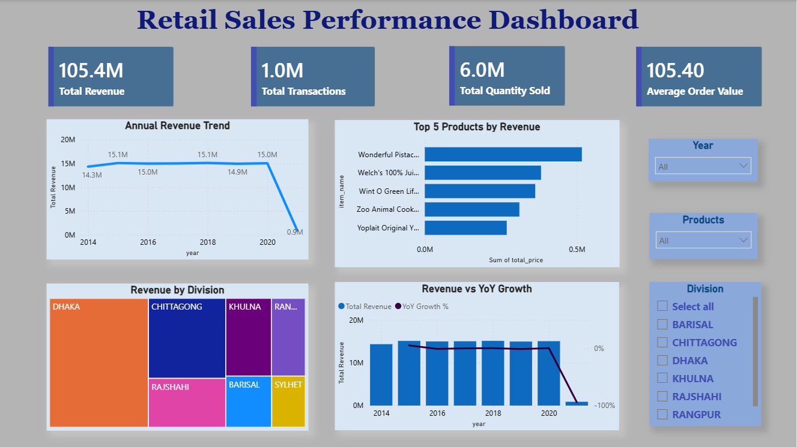

# 📊 Retail Sales Performance Dashboard

An interactive Power BI dashboard built to analyze retail sales performance using **PostgreSQL, SQL, Power BI, and DAX**. This project transforms raw retail sales data into meaningful business insights through data modeling, SQL analysis, and interactive visualizations.

---

## 📷 Dashboard Preview

The dashboard provides an interactive view of retail sales performance across different years, products, and divisions.


---

# 📌 Project Overview

The Retail Sales Performance Dashboard is an end-to-end Data Analytics project developed using PostgreSQL, SQL, Power BI, and DAX. It analyzes retail sales data to uncover revenue trends, product performance, and regional insights through interactive visualizations and KPI tracking.

---

# 🎯 Business Objectives

- Monitor overall sales performance.
- Track yearly revenue trends.
- Identify top-performing products.
- Compare revenue across different divisions.
- Analyze Year-over-Year (YoY) revenue growth.
- Build an interactive dashboard for business users.

---

# 🛠️ Tools & Technologies

- PostgreSQL
- SQL
- Power BI
- DAX
- Microsoft Excel

---

# 🗂️ Dataset

The project uses a retail sales dataset consisting of:

- Fact Table
- Customer Dimension
- Item Dimension
- Store Dimension
- Time Dimension
- Transaction Dimension

---

# 📊 Key Performance Indicators (KPIs)

- 💰 Total Revenue
- 🛒 Total Transactions
- 📦 Total Quantity Sold
- 💵 Average Order Value

---

# 📈 Dashboard Visualizations

- Annual Revenue Trend
- Top 5 Products by Revenue
- Revenue by Division
- Revenue vs Year-over-Year (YoY) Growth

---

# 🎛️ Interactive Filters

- Year
- Product
- Division

---

# 🗄️ SQL Analysis

SQL was used to:

- Create database tables
- Import retail sales data into PostgreSQL
- Calculate Total Revenue
- Calculate Total Transactions
- Calculate Total Quantity Sold
- Calculate Average Order Value
- Analyze Revenue Trend by Year
- Analyze Revenue by Division
- Identify Top Products by Revenue

---

# 📊 DAX Measures

The following DAX measures were created in Power BI:

- Total Revenue
- Total Transactions
- Total Quantity Sold
- Average Order Value
- Previous Year Revenue
- YoY Growth %

---

# 💡 Key Insights

- Revenue remained consistent across most years before declining in 2021.
- A small number of products contribute significantly to overall revenue.
- Dhaka generated the highest revenue among all divisions.
- Interactive filters allow users to analyze sales by year, product, and division.

---

# 📁 Repository Structure

```text
Retail-Sales-Performance-Dashboard
│
├── Dashboard
│   └── Retail sales performance dashboard.pbix
│
├── Dataset
│   ├── customer_dim.csv
│   ├── fact_table.csv
│   ├── item_dim.csv
│   ├── store_dim.csv
│   ├── time_dim.csv
│   └── trans_dim.csv
│
├── Images
│   └── Dashboard.png
│
├── SQL
│   └── Retail sales SQL queries.sql
│
└── README.md
```

---

# 🚀 Skills Demonstrated

- SQL Query Writing
- PostgreSQL Database Management
- Data Modeling
- Data Import & Transformation
- Power BI Dashboard Development
- DAX Calculations
- Data Visualization
- Business Analysis

---

# 👩‍💻 Author

**Lavanya**

Aspiring Data Analyst

---

⭐ If you found this project interesting, feel free to explore the repository and provide feedback.
